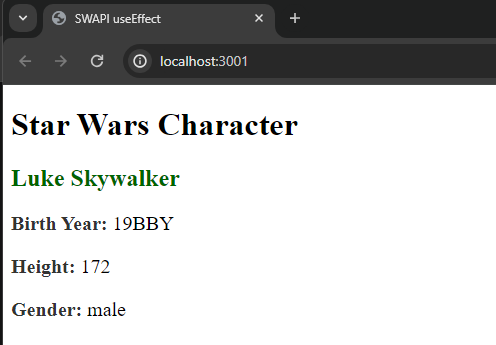

# Next.js Assignment 3

## Objective

This assignment aims to deepen your understanding of the useEffect hook in React by applying it to a practical scenario: fetching data from the Star Wars API (SWAPI). You will create a component that fetches character data, displays this data, and incorporates loading states and error handling to manage the fetch operation's various states effectively.

## Star Wars Character Display

This project fetches and displays information about a specific Star Wars character from the Star Wars API (SWAPI).

### Description

StarWarsCharacter.jsx : contains a component named 'StarWarsCharacter'. This component fetches data about a specific Star Wars character from SWAPI and displays it. It uses Axios get data from the API and the useState & useEffect hooks to manage state and perform side effects.

Once the data is successfully retrieved it displays the fetched character's name, birth year, height, and gender. Error handling is implemented to display an error message if the data fetching process encounters any issues. Additionally, a loading state is managed to display a loading indicator while data is being fetched.

### Screenshot



This is a [Next.js](https://nextjs.org/) project bootstrapped with [`create-next-app`](https://github.com/vercel/next.js/tree/canary/packages/create-next-app).

## Getting Started

First, run the development server:

```bash
npm run dev
# or
yarn dev
# or
pnpm dev
# or
bun dev
```

Open [http://localhost:3000](http://localhost:3000) with your browser to see the result.

You can start editing the page by modifying `app/page.js`. The page auto-updates as you edit the file.
